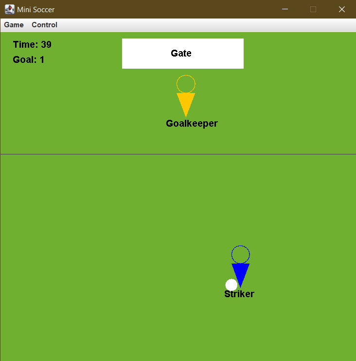
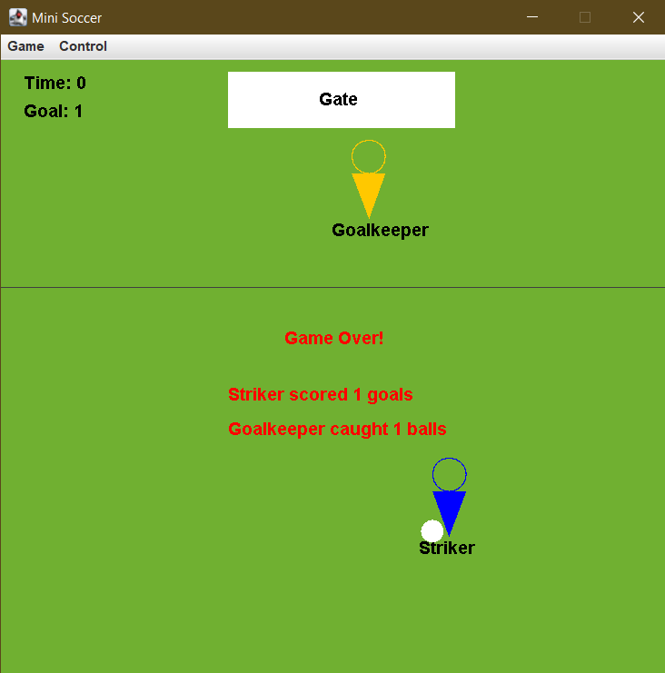

# Mini Soccer Game 

A mini soccer game written in Java 11 using Java Swing.

Featuring design pattern/principle:

* Singleton
* Iterator
* Factory
* Sorting
* Collection
* Polymorphism
* Inheritance

## Control/Rules

### Movement

Use the `ArrorKeys` to control the movement of `Striker`.

`Goalkeeper` moves randomly in a gaussian distribution fashion, where the center of the gate
acts as the `mean value`.

`Striker` and `Goalkepper` cannot cross the penalty line.

### Ball control

Use the `Spacebar` to shoot bar with the `Stiker`.

`Goalkeeper` will pick up `SoccerBall` if the ball falls within its side of the penalty line and
not in the gate.

`GamePlayer` will pick up `SoccerBall` if they're within `55` radius of each other.

### Score/Catch ball

If the `SoccerBall` shot by `Striker` lands in the gate area, the `goal` of the current game will
increment by 1, game will set to `pause`, and the position of `SoccerBall`, `Stiker` and `Goalkeeper` will be reset.

If the `SoccerBall` shot by `Striker` lands in its side of the penalty line, nothing will happen.

If the `SoccerBall` shot by `Striker` lands in the other side of the penalty line, and not in the
gate area, `Goalkeeper` will catch the `SoccerBall` automatically and considered have **caught 1 ball**.
Then `Goalkeeper` will kick the `SoccerBall` back to the `Striker` side of the penalty line.

### Game states

Game is `over` if and only if the remaining time is `0`.

If the game is on `pause`, neither `GamePlayer` nor `SoccerBall` can move.

If the game is `over`, the statistics of each `GamePlayer` will be sorted and displayed, while all controls,
including `pause` and `resume` will be disabled until a new `SoccerGame` is started.

## Screenshots

| In game    | Game over   |
| :------------: | :----------: |
|  |  |
`=`
| Javadoc: https://or9.ca/soccer | CodeCov: https://app.codecov.io/gh/orionnelson/football-game |
| Demo: https://youtu.be/2aL0P4bcZAM |                                                          |

### football-game 

### Testing Methods 
## Testing Was Done Using GitHub Workflows
Using github workflows for testing we were able to automaticly generate our testing coverage and evaluating test cases to rule out bugs in the code. 

|  |

## Test Case Breakdown
The Test Cases Were Broken Down Into Three Catagories
## Test Case OverView
|      Id        |  TestGroup   |   Description |
| :------------: | :----------: | :----------:  | 
|  | ListenerTests     |   Dealt with making sure that all the input mappings and core events were working correctly `Robot` keyevent    |
|  | MenuListenerTests |  Worked with the menu events and performed tests using `java.awt.Robot` with mousevent/keyevent                 | 
|  |   ModelTests     |  Tests Model Init and and if all of the methods of model are working correctly                                   |
 

